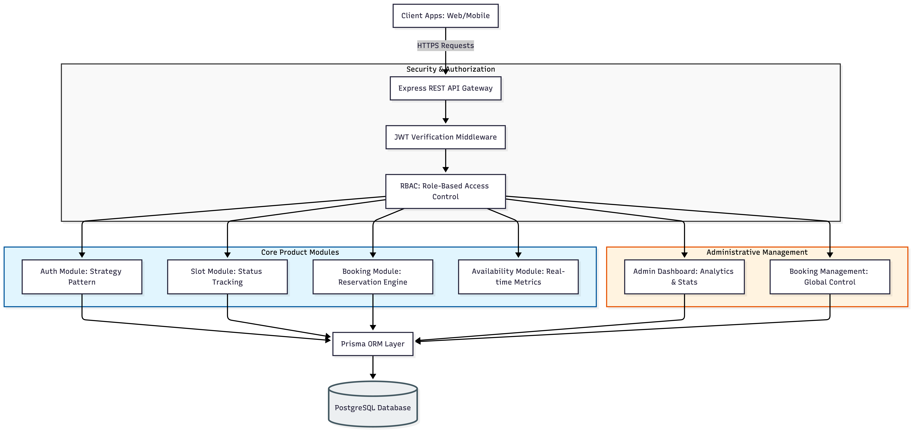
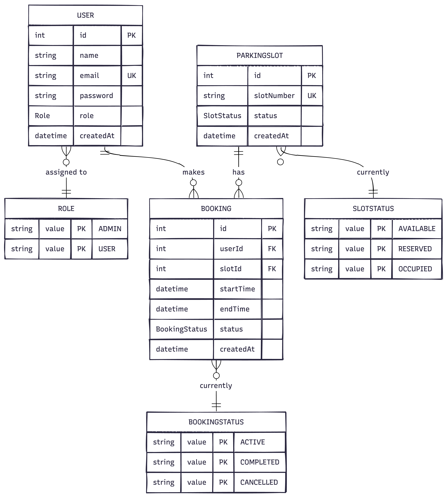

# VectraSlot - Smart Parking Management System

**A type-safe, role-based backend architecture for real-time parking slot management and reservation systems.**

---

## Project Overview

VectraSlot is a backend-driven parking platform designed for automated slot tracking and secure user reservations. The system implements a robust Role-Based Access Control (RBAC) model to differentiate administrative oversight from standard user interaction, ensuring system integrity and data security.

---

## Table of Contents
- [Project Overview](#project-overview)
- [System Architecture](#system-architecture)
- [Database Design](#database-design)
- [Implemented Modules](#implemented-modules)
- [Testing Specifications](#testing-specifications--workflow)

---

## System Architecture

The application follows a layered modular architecture, ensuring decoupled logic across authentication, management, and core business services.

*Figure 1: High-level architectural design showcasing module interactions and data flow.*

---

## Database Design

The following represents the current relational structure of the VectraSlot database:

*Figure 2: Relational mapping of Users, Parking Slots, and Reservation Bookings.*

---

## Implemented Modules

### 1. Auth & Middleware
*   **Strategy Pattern**: Encapsulated login logic for `USER` and `ADMIN`.
*   **Security**: JWT-based session handling with specific Role-based guards.

### 2. Admin & Management
*   **Slot Module**: Complete CRUD for parking infrastructure.
*   **Booking Management**: System-wide oversight and modification capabilities.
*   **Analytics**: Real-time stats engine for total occupancy and growth.

## API Endpoints

### Authentication Module
| Method | Endpoint | Description | Auth Required |
| :--- | :--- | :--- | :--- |
| POST | `/api/auth/register` | User Registration (Locked to USER role) | No |
| POST | `/api/auth/login` | Secure Role-Based Login | No |

### Admin Panel (Protected)
| Module | Method | Endpoint | Functionality |
| :--- | :--- | :--- | :--- |
| **Users** | GET | `/api/admin/users` | List all system users |
| | GET | `/api/admin/users/:id` | View detailed user profile |
| | PATCH | `/api/admin/users/:id/role` | Update user role permissions |
| | DELETE | `/api/admin/users/:id` | Remove user account |
| **Slots** | POST | `/api/admin/slots` | Initialize new parking slot |
| | GET | `/api/admin/slots` | Monitor slot occupancy & status |
| | PATCH | `/api/admin/slots/:id` | Modify slot configuration |
| | DELETE | `/api/admin/slots/:id` | Decommission parking slot |
| **Bookings**| GET | `/api/admin/bookings` | View all system-wide bookings |
| | GET | `/api/admin/bookings/:id` | Inspect specific booking details |
| | PATCH | `/api/admin/bookings/:id` | Adjust or moderate active booking |
| | DELETE | `/api/admin/bookings/:id` | Expunge booking record |
| **Analytics**| GET | `/api/admin/stats` | Real-time Dashboard statistics |

---

## Testing Specifications & Workflow

### 📋 Request Parameters & Naming Conventions

| Action | Parameter Name | Expected Type |
| :--- | :--- | :--- |
| **Login** | `email`, `password`, `role` | `String` |
| **Admin Secret** | `adminSecret` | `String` (Required for Admins) |
| **Slot Creation** | `slotNumber` | `String` |
| **Role Update** | `role` | `String` (`ADMIN` \| `USER`) |

### 🔄 Testing Flow

1.  **Auth**: Execute `POST /api/auth/login`. Retrieve the JWT `token`.
2.  **Access**: All subsequent requests must use `Authorization: Bearer <TOKEN>`.
3.  **Role Verification**: Admin routes (`/api/admin/*`) strictly validate for the `ADMIN` role and secret key.

---

## Current Status

*Project core foundation is established. Advanced parking logic and availability algorithms are in development.*

*still building processing*
